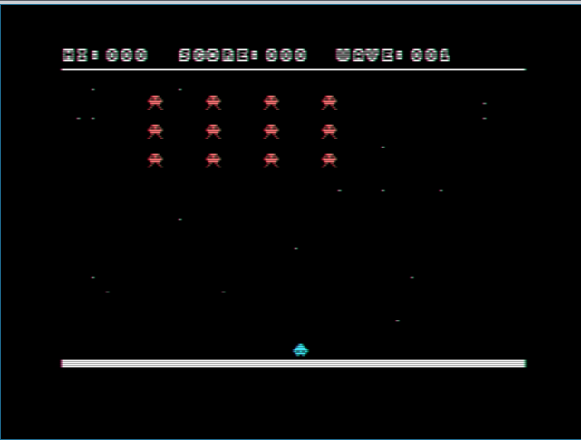
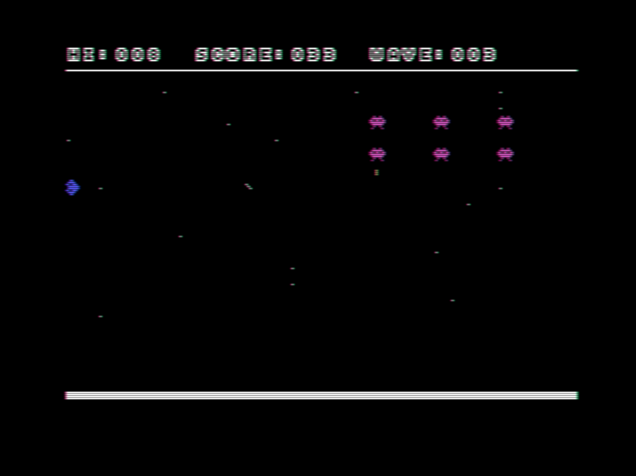

# Micro Invasion

**Micro Invasion** is a space invaders style MSX1 game powered by the [MSXgl](https://github.com/aoineko-fr/MSXgl) graphics library. It has been tested and verified on authentic hardware, specifically the [MSX HotBit HB-8000](https://pt.wikipedia.org/wiki/HotBit_HB-8000).

## Screenshots




## Prerequisites

- **Git:** Ensure you have Git installed to clone the repositories.
- **Build Environment:** A working MSX1 development environment (Windows, Linux, etc.) with support for batch or shell scripts.

## Installation

Follow these steps to set up the project:

1. **Clone the MSXgl Repository**

   Open your terminal (or command prompt) and execute:
   ```bash
   git clone https://github.com/aoineko-fr/MSXgl.git
   ```

2. **Add the Micro Invasion Project**

   Clone the Micro Invasion repository:
   ```bash
   git clone https://github.com/rflamino/microinvasion.git
   ```
   Then, move the cloned `microinvasion` folder into the `projects` directory of MSXgl so that your folder structure looks like this:
   ```
   MSXgl/
   └── projects/
       └── microinvasion/
   ```

3. **Build the Project**

   Depending on your operating system, run the appropriate build script from the root of the MSXgl repository:

   - **Windows:**
     ```cmd
     build.bat
     ```
   - **Linux/macOS:**
     ```bash
     ./build.sh
     ```
